# Практическое занятие №11
# Саттаров Булат Рамилевич ЭФМО-01-25
# Создание GraphQL API с использованием gqlgen. Запросы и мутации

---
## 1. Схема GraphQL (schema.graphqls)

```graphql
type Task {
  id: ID!
  title: String!
  description: String
  dueDate: String
  done: Boolean!
}

type Query {
  tasks: [Task!]!
  task(id: ID!): Task
}

input CreateTaskInput {
  title: String!
  description: String
  dueDate: String
}

input UpdateTaskInput {
  title: String
  description: String
  dueDate: String
  done: Boolean
}

type Mutation {
  createTask(input: CreateTaskInput!): Task!
  updateTask(id: ID!, input: UpdateTaskInput!): Task!
  deleteTask(id: ID!): Boolean!
}
```

Task:
- Описывает сущность задачи.

Query:
- tasks: [Task!]! – возвращает список всех задач
- task(id: ID!): Task – возвращает задачу по ID

Mutation:
- createTask(...) – создаёт новую задачу
- updateTask(...) – обновляет задачу по ID
- deleteTask(id: ID!): Boolean! – удаляет задачу и возвращает результат операции

CreateTaskInput:
- Используется при создании задачи

UpdateTaskInput:
- Используется при обновлении задачи

## 2. Резолверы и связь с данными

Резолверы находятся в пакете:
services/graphql/internal/graph

Они используются как слой адаптер между GraphQL схемой и внутренней бизнес-логикой приложения.

Резолверы не работают с базой данных напрямую.

Они обращаются к сервисному слою через поле:

r.Resolver.Service

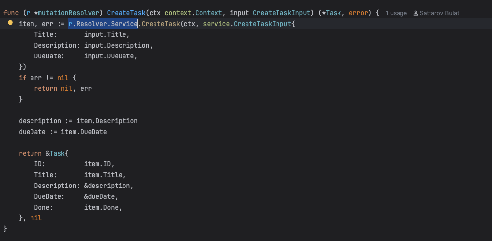

## 3. Примеры запросов

### Создание
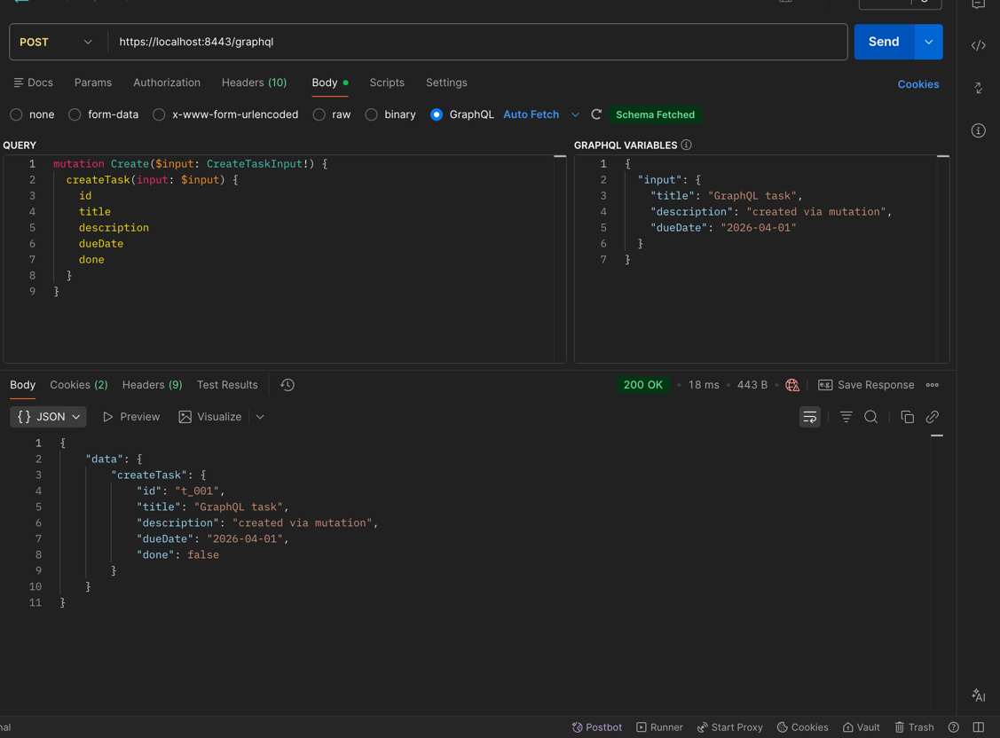

### Изменение

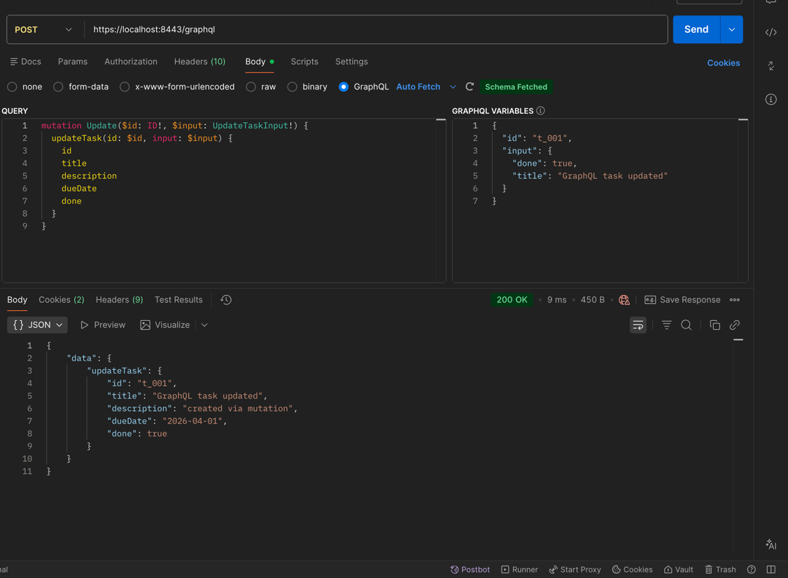

### Чтение по id

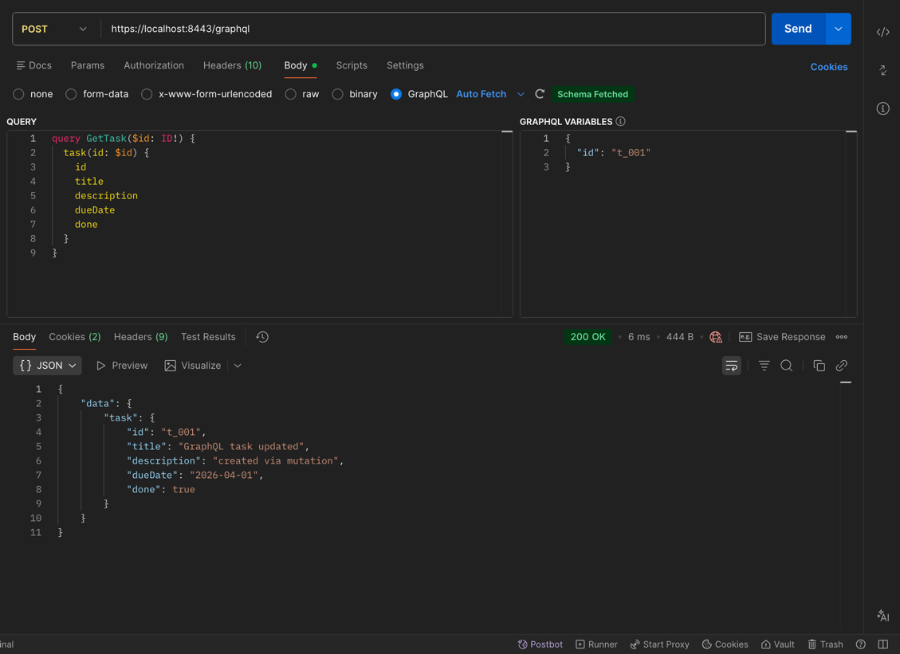

### Чтение по id только необходимых полей

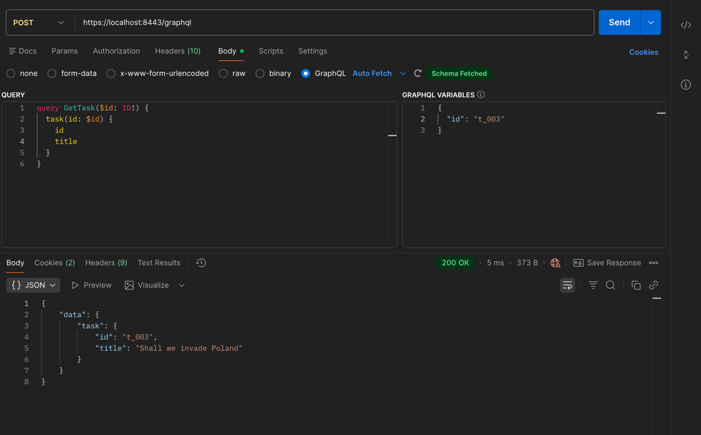

### Список

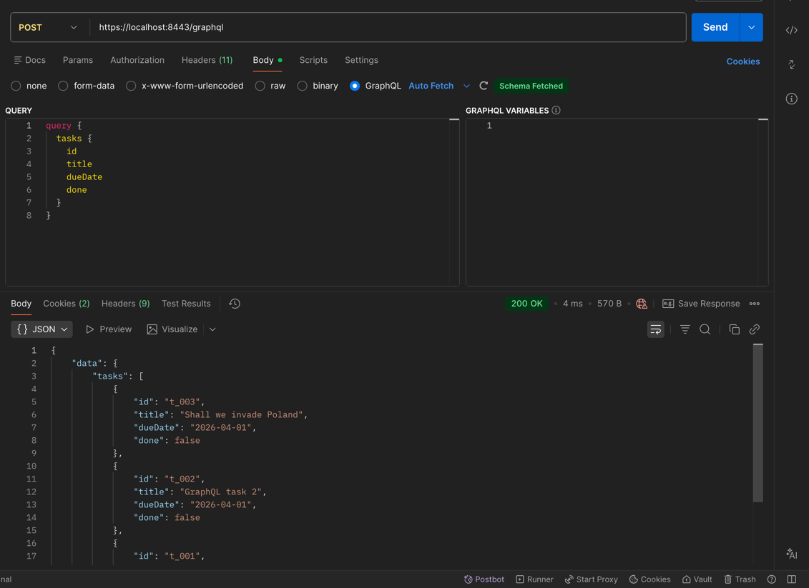


### Удаление
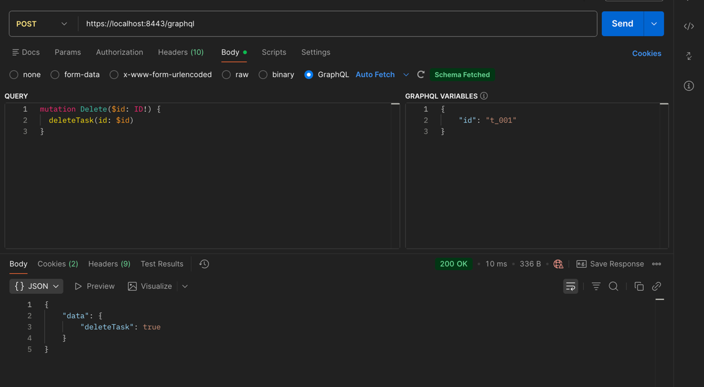

### Проверка удаления

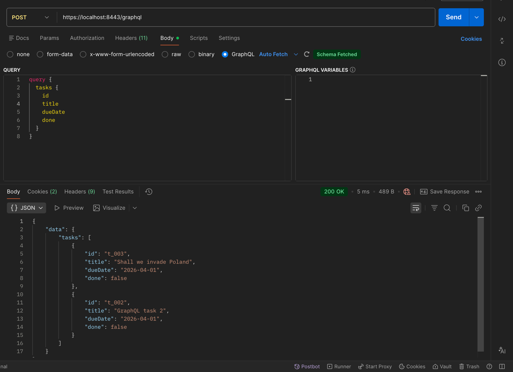

## 4. Запуск
```bash
cd deploy
cp .env.example .env
docker compose up -d --build
```
Запросы по этому адресу:
https://localhost:8443/graphql

Playground:
https://localhost:8443/playground

## 5. Авторизация

В системе используется cookie-based авторизация через внешний auth сервис.
Проверка выполняется на уровне middleware в GraphQL сервисе, до обработки резолверов.
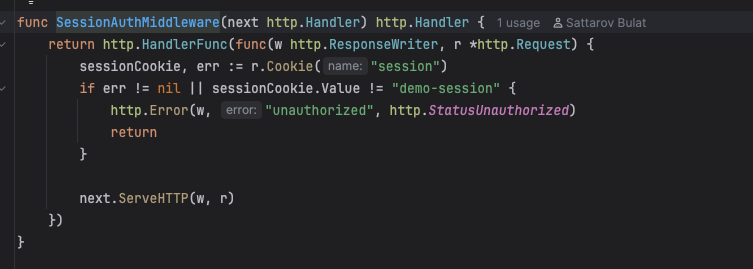
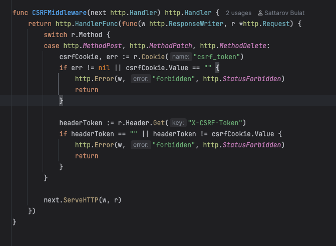

Логин
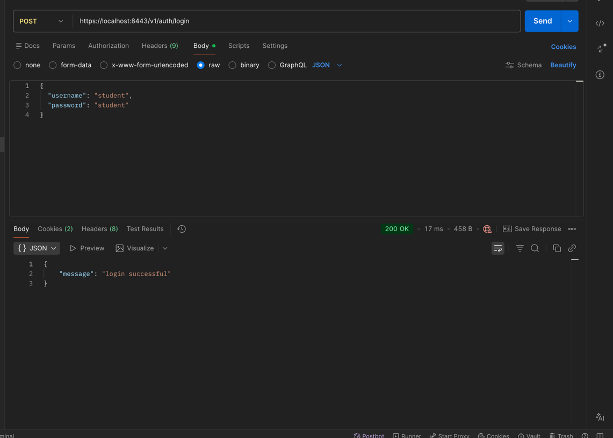
session cookie 
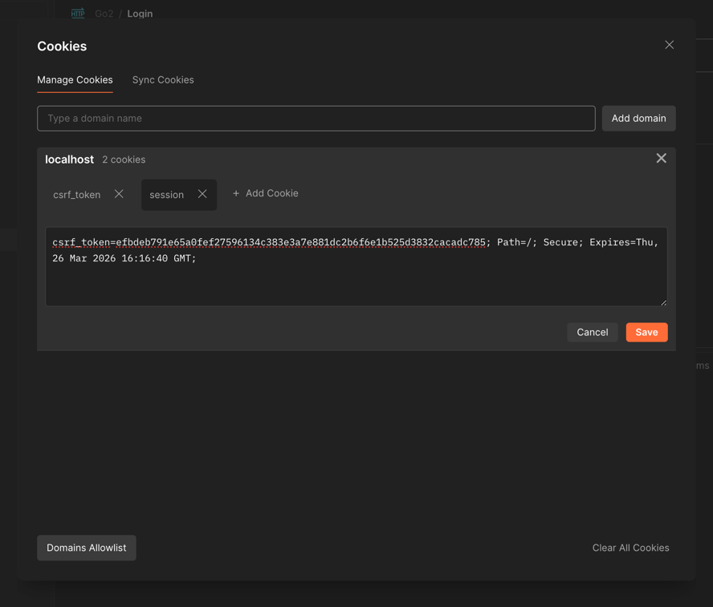
csrf_token
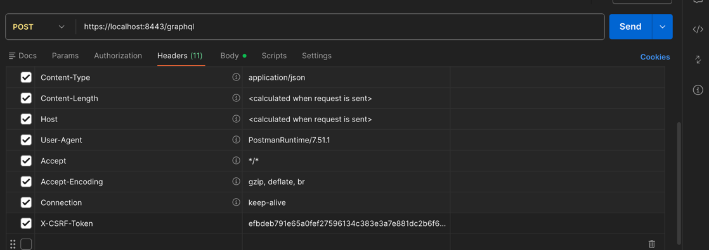

401 → нет session  
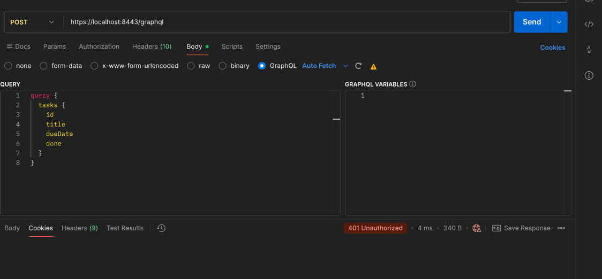

403 → нет csrf  
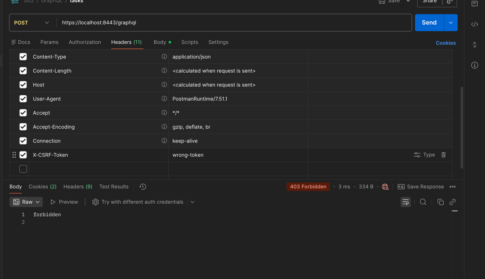

